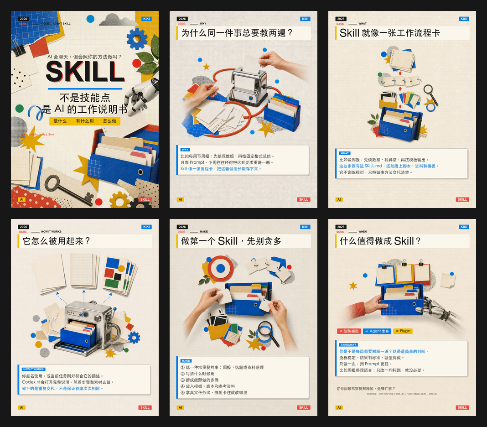
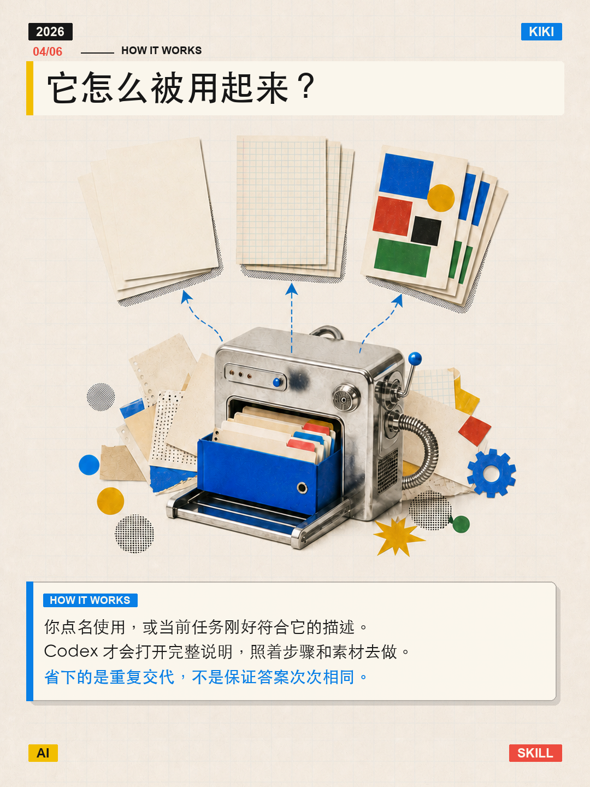

# 轻复古拼贴风格笔记自动生成 Skill

[](https://github.com/kiki-lgtm-dot/light-retro-collage-xiaohongshu-skill/actions/workflows/validate-skill.yml)

把关键词、长文、文件、截图或混合资料，整理成适合小红书发布的 3:4 知识图解。

它不会拿到资料就直接出图，而是先分析值得发的选题角度、查证核心事实、规划页数和内容节奏，待用户确认后再完成文案、插画、排版与质量检查。默认面向对 AI 感兴趣的小白读者，强调准确、好懂、值得收藏。

Skill ID：`generate-light-retro-collage-xhs-notes`

## 核心能力

- 从关键词、文章、笔记片段、文件、截图等资料中先提炼选题，再决定发什么
- 对专业概念和时效信息进行联网查证与交叉验证
- 用生活化案例解释抽象概念，减少术语和模板化“AI 味”
- 先推荐 4–12 页结构并等待确认，再开始生成
- 支持封面、文字中心、插画中心三种版式混排
- 输出 1080×1440、3:4 竖版 PNG
- 自动生成 1 个推荐标题、2 个备选标题及不超过 200 字的正文
- 每页保留 `2026`、`KIKI`、`AI` 和当期真实主题词角标
- 检查事实来源、文字溢出、元素重叠、安全距离、异常裁切和图像噪点

## 效果案例

案例主题：**Skill 是什么、有什么用、怎么做**

### 六页组合预览

[](assets/examples/light-retro-collage-case-contact-sheet.png)

### 六张高清单页

<table>
  <tr>
    <td align="center" width="33%">
      <br>
      <sub>01｜封面</sub>
    </td>
    <td align="center" width="33%">
      <br>
      <sub>02｜为什么需要 Skill</sub>
    </td>
    <td align="center" width="33%">
      <br>
      <sub>03｜Skill 是什么</sub>
    </td>
  </tr>
  <tr>
    <td align="center" width="33%">
      <br>
      <sub>04｜如何运行</sub>
    </td>
    <td align="center" width="33%">
      <br>
      <sub>05｜怎么制作</sub>
    </td>
    <td align="center" width="33%">
      <br>
      <sub>06｜适用边界</sub>
    </td>
  </tr>
</table>

### 无文字风格参考


## 下载与安装

根据 [OpenAI 官方 Skill 文档](https://learn.chatgpt.com/docs/build-skills)，Codex 的用户级 Skill 目录为 `$HOME/.agents/skills`。Codex 通常会自动检测新增或更新后的 Skill；如果没有出现，请重启 Codex。

### 方式一：下载 GitHub ZIP

打开仓库右上角的 **Code → Download ZIP**，或直接下载：

[**下载 main 分支 ZIP**](https://github.com/kiki-lgtm-dot/light-retro-collage-xiaohongshu-skill/archive/refs/heads/main.zip)

解压后，将文件夹重命名为：

```text
generate-light-retro-collage-xhs-notes
```

再把整个文件夹放入：

```text
$HOME/.agents/skills/
```

Windows 通常对应 `$HOME\.agents\skills\`。

### 方式二：让 Codex 安装

在 Codex 中输入：

```text
请使用 $skill-installer 安装这个 Skill：
https://github.com/kiki-lgtm-dot/light-retro-collage-xiaohongshu-skill
```

### 方式三：使用 Git Clone

macOS / Linux：

```bash
mkdir -p "$HOME/.agents/skills"
git clone https://github.com/kiki-lgtm-dot/light-retro-collage-xiaohongshu-skill.git \
  "$HOME/.agents/skills/generate-light-retro-collage-xhs-notes"
```

Windows PowerShell：

```powershell
New-Item -ItemType Directory -Force "$HOME\.agents\skills" | Out-Null
git clone https://github.com/kiki-lgtm-dot/light-retro-collage-xiaohongshu-skill.git `
  "$HOME\.agents\skills\generate-light-retro-collage-xhs-notes"
```

安装前请确认目标目录中不存在同名文件夹，避免形成嵌套目录或覆盖旧文件。

## 快速使用

在 Codex CLI 或 IDE 扩展中输入 `/skills`，或使用 `$` 点名该 Skill：

```text
请使用 $generate-light-retro-collage-xhs-notes，
把我接下来提供的资料整理成一组面向 AI 小白的小红书知识图解。
先分析适合发布的选题，给出推荐页数和逐页规划，等我确认后再生成。

资料：
[粘贴文字，或上传文件、截图]
```

或者直接给一个概念：

```text
请使用 $generate-light-retro-collage-xhs-notes，
解释 RAG 是什么、为什么需要它，并用一个职场中的例子讲清楚。
先完成查证和六页规划，不要立刻出图。
```

典型流程：

1. 分析资料与选题
2. 查证事实和概念边界
3. 推荐页数与逐页脚本
4. 用户确认
5. 生成文案和无文字插画
6. 本地排版、验证并输出 PNG

## 可选：本地自检

渲染脚本需要 Python 3、Pillow、JSON Schema 和可用的中文字体。

```bash
cd "$HOME/.agents/skills/generate-light-retro-collage-xhs-notes"
python3 -m pip install -r scripts/requirements.txt
python3 scripts/self_test.py
```

正式渲染时可通过 `--font` 或 `XHS_FONT_PATH` 指定具有合法使用权限的中文字体。

## 质量规则

- 先确定文字内容和真实占位，再分配插画区域
- 标题、插画、正文之间的安全距离随文字量动态调整
- 文字较少时放大插画，文字较多时优先保证可读性
- 序号内容必须严格从上到下排列
- 中文文字使用真实字体本地排版，不让图像模型生成伪文字
- 人物、手部或物体越过边缘时使用自然渐隐，避免生硬截断
- 保留干净、不可变的插画母版；修改构图时从母版重新处理
- 纸张与印刷噪点只在最终合成时添加一次
- 文字溢出、元素重叠、异常留白、重复纹理、边缘光晕或累计噪点均视为不合格
- 自动几何检查通过后，仍需人工核对汉字、数字、单位、来源和事实表达

完整工作流与约束请阅读 [SKILL.md](SKILL.md)。

## 文件结构

```text
.
├── README.md
├── SKILL.md
├── agents/
├── assets/
│   ├── examples/
│   ├── layouts/
│   ├── palettes/
│   ├── style-reference/
│   └── project-schema.json
├── references/
├── scripts/
├── tests/
└── LICENSE
```

## 许可

本项目使用 [Apache License 2.0](LICENSE) 开源。
